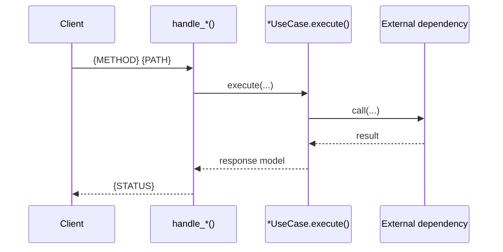

# API Endpoint: {METHOD} {PATH} — {Short purpose}

---

## Metadata

| Field             | Value                                                      |
|-------------------|------------------------------------------------------------|
| **File Name**     | `{endpoint}.md` *(naming convention only, omit from document)* |
| **Domain**        | `{domain_name}`                                            |
| **Owner(s)**      | `@ldap1`, `@ldap2`                                         |
| **Last Updated**  | YYYY-MM-DD                                                 |

---

## Endpoint

- **Method/Path**: `{METHOD} {PATH}`
- **Summary**: *One sentence describing what it does.*
- **Stability**: Stable / Evolving / Experimental

---

## Code pointers

- **Route handler**: `.../routes/...py::handle_*` *(real path in your domain)*
- **Dependency wiring** *(if applicable)*: `.../dependencies/...py::get_*_dependency`
- **Request schema** *(if applicable)*: `.../schemas/...py::{RequestSchema}`
- **Response schema** *(if applicable)*: `.../schemas/...py::{ResponseSchema}`
- **Use case / service** *(if applicable)*: `.../use_cases/...py` or `.../services/...py`
- **Infra/services** *(if applicable)*: *list key dependencies here (Cache, BigQuery, GenAI, etc.)*

---

## Contract

### Authentication & authorization

*Describe how auth is enforced (gateway/middleware/dependencies). If not defined here, say where it is enforced.*

### Request

- **Headers**: *(if any)*
- **Query params**: *(if any)*
- **Body**: `{SchemaName}`

### Response

- **Body**: `{SchemaName}` *(or “no body”)*  

### Status codes

- `2xx`: *success cases*
- `4xx`: *client errors*
- `5xx`: *server errors*

### Errors (what can go wrong)

| Status | Error | When |
|--------|-------|------|
| 400 | *validation error* | *bad input* |
| 404 | *not found* | *resource missing* |

---

## Caching & consistency

- **Cache key/namespace** *(if any)*: `{namespace}:{key}`
- **TTL** *(if any)*: `{seconds}`
- **Consistency**: *eventual/strong; fallback behaviors; cache invalidation rules*

---

## Side effects

*Describe writes, background jobs, external calls, and idempotency expectations.*

---

## Observability

- **Logs**: *what gets logged*
- **Metrics**: *what should be emitted*
- **Tracing**: *trace/headers expectations*

---

## Sequence diagram

### Naming guidelines (for consistency)

- **Diagram heading** should be: `{METHOD} {PATH} — {intent}`.
- **Participants**: use role-based names (Client, Route, UseCase, Repo, Cache, ExternalService) and optionally alias to real function/class names.
- **Messages**: use verb phrases and/or real method names (`execute(...)`, `get(...)`, `query_to_df(...)`).
- Prefer `alt/opt/loop` for branching and pagination.
- Keep it **readable**: don’t model every internal line; model the contract-level interactions.



---

## Examples

### Request

```http
{METHOD} {PATH}
Content-Type: application/json

{ "example": true }
```

### Response

```json
{ "status": "ok" }
```

---

## References

- *Link related feature docs or external references here.*

---

## Agent Instructions

<!--
AGENT:
- Confirm base path and versioning (`/api/v1/...`)
- Pull request/response schemas from code (do not guess fields)
- List real status codes (from handler behavior)
- Add caching/side effects only if they exist
- Keep the sequence diagram at “system interaction” level (not line-by-line)
-->